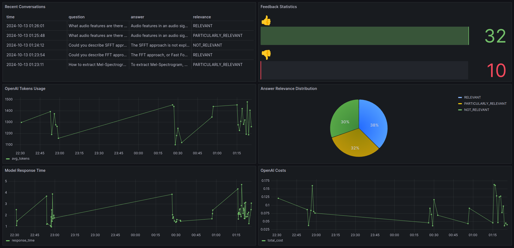

# YouTube Browser


AI assistant that will help you gain knowledge from "The Sound of AI" YouTube channel on how to process audio signal for creating audio apps like Generative Music AI app, Audio Signal Processing, Sound Generation using Neural Networks, Deep Learning in Audio apps, etc. This project was created as a part of the LLM Zoomcamp course.

## Background

It is known that the YouTube platform contains a huge amount of information, which is quite difficult to get using the classic and familiar search methods that we are used to using, such as Google search. To search for information on YouTube, you need to not only find the desired video, but also watch it, which requires a lot of time. For this reason, the YouTube platform is used mainly as an entertainment platform. However, there are a huge number of educational and informative videos from which we would really like to draw information as in a regular Google search engine.

## Goal of the project

The main goal of this project is to create an AI assistant that could search for information in the content of YouTube videos and return back human-readable answers, as if we were looking for information in a regular search engine.

## Solution

As part of this project, an YouTube Browser system was created, which provides the ability to search for information in YouTube playlists, such as in the Google search engine. YouTube Browser is a Retrieval Augmented Generation application, the main goal of which is to provide answers for user questions based on content in YouTube videos.
The information in the YouTube Browser knowledge base contains transcribed audio files from two playlists, "Audio Deep Learning with Python" and "Audio Signal Processing for ML", from The Sound of AI channel. These playlists contain technical information on how to work with audio files, how to process an audio signal using popular Python libraries, what physical parameters an audio signal has, how to apply Deep Learning models to build AI applications based on neural networks, etc.

As part of the project, code was developed that allows you to download audio tracks from YouTube video playlists and transcribe them using the Amazon Transcribe service. As a result, transcripts of the video content were obtained with time codes, as well as broken down into chunks. However, one chunk does not always contain complete information to answer a question. For this reason, the resulting dataset was transformed so that each chunk also contained information from the two following chunks as well. In addition, 10 questions were generated for the contents of each chunk using LLM OPenAI ChatGPT and also added to the dataset. Based on the search for the generated questions, as well as the contents of the chunks, the ranking of answers will be performed using ElasticSearch. The Context was formed based on the answer from ElasticSearch. At the final stage, LLM get the context and question from our system and generate human-readable answer based only on relevant information from out knowledge database (the samples of relevant and un-relevant answers you can see below). 

## Demo of the YouTube Browser application

<video width="640" height="360" controls>
    <source src="imahes/demo.mp4" type="video/mp4">
    Your browser does not support the video tag.
</video>


## Files and directory description


`app` - RAG application

    `app.py` - Streamlit app (UI interface)

    `db.py` - Postgres app (all queries to DB)

    `es.py` - ElasticSearch app (all queries to ElasticSearch to search info)

    `rag.py` - RAG app (build prompt, send queries to LLM)

    `data_ingestion.py` - Ingestion app (Creating, ingestion, indexing documents)

    `config.py` - Reading environmental params into variables

    `data` - Directory with datasets. Contain two transcribed playlists in json format. 

    `logs` - Directory with logs. The system save logs for each container.

`data_prep` - Directory for creating dataset

    `The Sound of AI` - Directory with transcripts of separate videos, temporary files, and final datasets as well.

    `amazon_stt.py` - Script to send queries to Amazon Transcribe service for transcribing each video from playlist.

    `create_dataset.py` - Script for creating dataset (some operations for merging, asking LLM to generate questions, etc.)

    `create_ground_truth_dataset.py` - Script for creating dataset (some operations for merging, asking LLM to generate questions, etc.)

    `download_audio.py` - Script for downloading audio tracks from YouTube.

    `credentials.py` - Config to run queries to Amazon Transcribe service.

    `text_helpers.py` - Some additional operations with text.

`docker-compose.yaml` - Docker compose to run several containers.

`Dockerfile.streamlit` - Docker file to run Streamlit app.

`Dockerfile.ingestion` - Docker file to run Ingestion in automatic mode while all containers starting.

`requirements.txt` - File with list of Python libraries which used in the system.

`grafana.md` - SQL queries to PostgreSQL database for using in Grafana UI.

`.env` - File with environment variables, which will be exported to the system while application starting.

`dashboard.json` - Exported file with dashboard description from Grafana. To see panels from dashboard, just need to import this file via Grafana UI.


## How to reproduce the project

The pipeline how to reproduce and run the system is described below.

### 1. Clone this repository into your folder on local machine

```
cd PATH-YOUR-LOCAL-DIRECTORY
git clone https://github.com/romanaumov/YouTube-Browser.git
```
### 2. Set up environmental variables

Set up environmental variables in file `.env`. Example of this file you can find in the main directory of the project with name `.env.example`.

### 3. Install Docker and  Docker-compose

You need install Docker and Docker-compose to run docker containers. 
So, it's very standard procedure. If you don't know how to install this software, please ask ChatGPT to get step-by-step instructions.

### 4. Run Dockers

Run the following commands in terminal:

```
cd PATH-YOUR-LOCAL-DIRECTORY
docker-compose build --no-cache
docker-compose up -d
```

### 5. Start work with the system "YouTube Browser"

After starting dockers you the streamlit application will be available at the address: `http://localhost:8501/`

You can see PostgreSQL database using pgAdmin at the address: `http://localhost:8080/browser/`

In addition you can check the status and problems with the system via logging. There are two ways to check:

1. Use command in terminal `docker logs -f <name_of_container>`. `-f` means see logs in real-time.
2. See logs.


## Examples of Monitoring using Grafana

SQL queries to PostgreSQL database was saved in the following file: [SQL queries](grafana.md)

There were developed the following dashboards:

1. Model Response Time
2. Answer Relevance Distribution
3. OpenAI Tokens Usage
4. OpenAI Costs
5. Recent Conversations
6. Feedback Statistics





## Meet the Project Evaluation Criteria

* Problem description
    * [ ] 0 points: The problem is not described
    * [ ] 1 point: The problem is described but briefly or unclearly
    * [x] 2 points: The problem is well-described and it's clear what problem the project solves
* RAG flow
    * [ ] 0 points: No knowledge base or LLM is used
    * [ ] 1 point: No knowledge base is used, and the LLM is queried directly
    * [x] 2 points: Both a knowledge base and an LLM are used in the RAG flow 
* Retrieval evaluation
    * [ ] 0 points: No evaluation of retrieval is provided
    * [ ] 1 point: Only one retrieval approach is evaluated
    * [x] 2 points: Multiple retrieval approaches are evaluated, and the best one is used
* RAG evaluation
    * [ ] 0 points: No evaluation of RAG is provided
    * [x] 1 point: Only one RAG approach (e.g., one prompt) is evaluated
    * [ ] 2 points: Multiple RAG approaches are evaluated, and the best one is used
* Interface
    * [ ] 0 points: No way to interact with the application at all
    * [ ] 1 point: Command line interface, a script, or a Jupyter notebook
    * [x] 2 points: UI (e.g., Streamlit), web application (e.g., Django), or an API (e.g., built with FastAPI) 
* Ingestion pipeline
    * [ ] 0 points: No ingestion
    * [ ] 1 point: Semi-automated ingestion of the dataset into the knowledge base, e.g., with a Jupyter notebook
    * [x] 2 points: Automated ingestion with a Python script or a special tool (e.g., Mage, dlt, Airflow, Prefect)
* Monitoring
    * [ ] 0 points: No monitoring
    * [ ] 1 point: User feedback is collected OR there's a monitoring dashboard
    * [x] 2 points: User feedback is collected and there's a dashboard with at least 5 charts
* Containerization
    * [ ] 0 points: No containerization
    * [ ] 1 point: Dockerfile is provided for the main application OR there's a docker-compose for the dependencies only
    * [x] 2 points: Everything is in docker-compose
* Reproducibility
    * [ ] 0 points: No instructions on how to run the code, the data is missing, or it's unclear how to access it
    * [ ] 1 point: Some instructions are provided but are incomplete, OR instructions are clear and complete, the code works, but the data is missing
    * [x] 2 points: Instructions are clear, the dataset is accessible, it's easy to run the code, and it works. The versions for all dependencies are specified.
* Best practices
    * [ ] Hybrid search: combining both text and vector search (at least evaluating it) (1 point)
    * [ ] Document re-ranking (1 point)
    * [ ] User query rewriting (1 point)
* Bonus points (not covered in the course)
    * [ ] Deployment to the cloud (2 points)
    * [x] Up to 3 extra bonus points (created dataset using Amazon Transcribe, automatic ingestion as separate container and logging of the entire system)


## Conclusion

The entire YouTube Browser project was developed as a part of LLM Zoomcamp. The system consists of many applications and Docker containers, such as Streamlit (UI interface), PostgreSQL Database, ElasticSearch, Ingestion, OpenAI API, Amazon Transcribe API, Logging:

1. **Streamlit** were used for Web server. 
2. **ElasticSearch** used to ranking and search relevant documents.
3. **OpenAI API** used to get interact with ChatGPT and generate text based on context from ElasticSearch.
4. **Amazon Transcribe** used to generate transcriptions from YouTube audio files.
5. **Data Ingestion** used as a separate module for ingestion dataset into ElasticSearch.
6. **PostgreSQL** Database for saving feedback and collecting statistics. 
7. **Logging** library to log any messages. 

## Future tasks

- Try Hybrid search: combining both text and vector search and evaluate it.
- Deploy to the cloud.
- Re-design UI.

If you have any questions, please feel free to ask me.